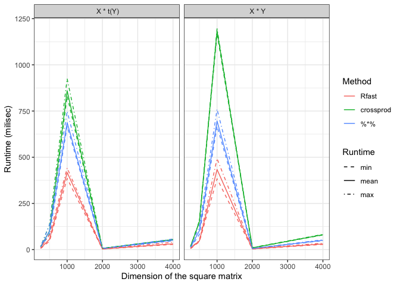

Matrix Multiplication in R
================

``` r
library(Rfast)
```

    ## Loading required package: Rcpp

    ## Loading required package: RcppZiggurat

``` r
library(microbenchmark)

## to create a N X N matrix
mat_creator <- function(n= 800) {
    matrix(rnorm(n*n, mean = 100, sd = 5), nrow = n)
}

results <- list()
results$xyT <- results$xy <- list()
```

# X %*% Y & X %*% t(Y)

``` r
set.seed(442)
for (n in c(250, 500, 1000, 2000, 4000)) {
    X <- mat_creator(n = n)
    results$xy[[sprintf("dims_%s", n)]]  <- microbenchmark(Rfast = Rfast::mat.mult(X , X),
                                                           crossprod = crossprod(X, X),
                                                           `%*%` = X %*% X,
                                                           times = 5L)
    
    results$xyT[[sprintf("dims_%s", n)]]  <- microbenchmark(Rfast = Rfast::mat.mult(X , t(X)),
                                                            crossprod = tcrossprod(X, X),
                                                            `%*%` = X %*% t(X),
                                                            times = 5L)
}
saveRDS(results, "results.rds")
```

``` r
results <- readRDS("results.rds")
```

``` r
dfs <- lapply(results, function(w){
    mapply(x=w, y=names(results[[1]]), FUN = function(x, y) {
        out <- summary(x)[,c("expr","min", "mean", "max")]
        out$dim <- as.integer(gsub(pattern = "dims_", replacement = "", x = y))
        out
    }, SIMPLIFY = FALSE)
})
```

``` r
library(ggplot2)
plot_mb <- function(dfs_list){
    
    dfs <- lapply(dfs_list, function(df){
        out <- do.call(rbind, df) %>% reshape2::melt(id.vars = c("dim", "expr"), variable.name = "type", value.name = "time")
        out
    })
    
    dfs2 <-  mapply(x = dfs, y = names(dfs), FUN = function(x, y){
        x$mult_type <- y
        x
    }, SIMPLIFY = FALSE)
    df2 <- do.call(rbind, dfs2)
    
    gg_color_hue <- function (n) 
    {
        hues = seq(15, 375, length = n + 1)
        grDevices::hcl(h = hues, l = 65, c = 100)[1:n]
    }
    
    cols <- gg_color_hue(length(levels(df2$expr)))
    names(cols) <- levels(df2$expr)
    df2$mult_type <- as.character(df2$mult_type)
    df2$mult_type[df2$mult_type == "xy"] <- " X * Y"
    df2$mult_type[df2$mult_type == "xyT"] <- " X * t(Y)"
    ggplot(df2) + geom_line(aes(dim, time, linetype = type, col = expr)) + facet_wrap(~ mult_type) + guides(col = guide_legend(title = "Method"), linetype = guide_legend(title = "Runtime")) + scale_linetype_manual(values = c(min=2, mean=1, max=4)) + labs(x = "Dimension of the square matrix", y = "Runtime (milisec)") + theme_bw()
}

plot_mb(dfs)
```

<!-- -->
